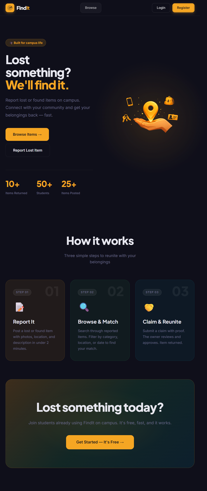
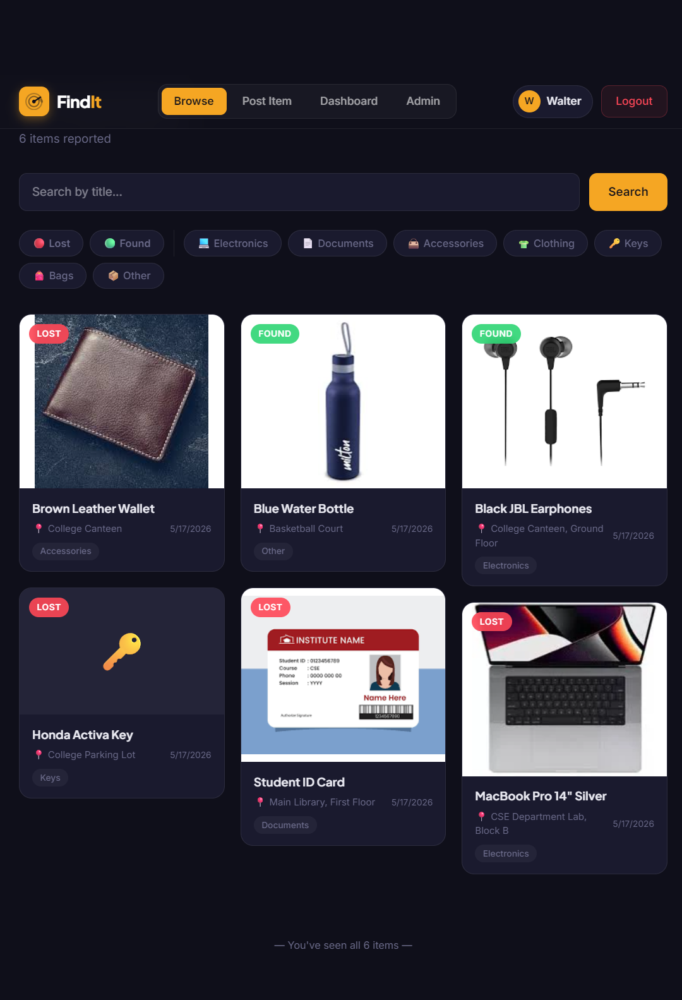
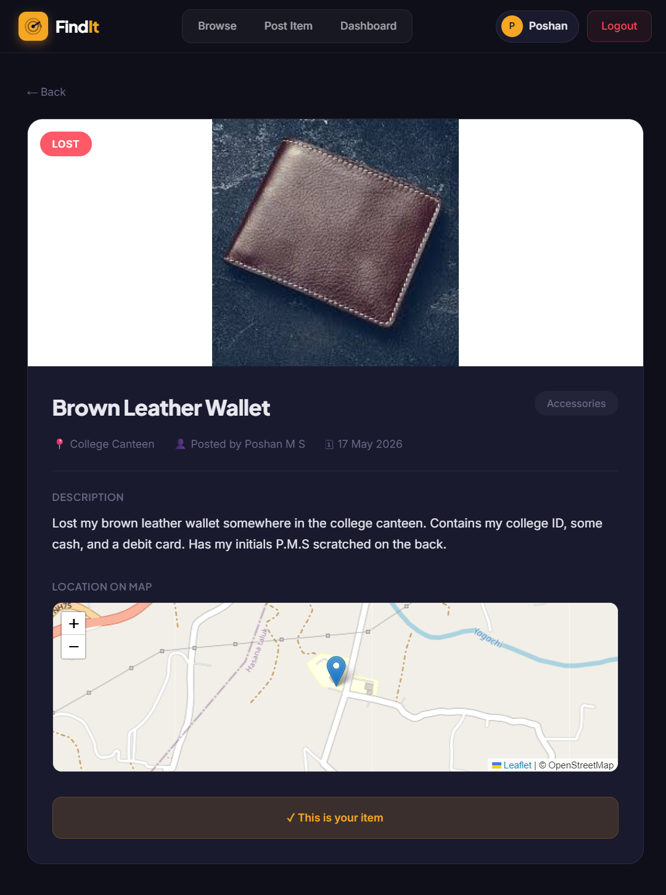
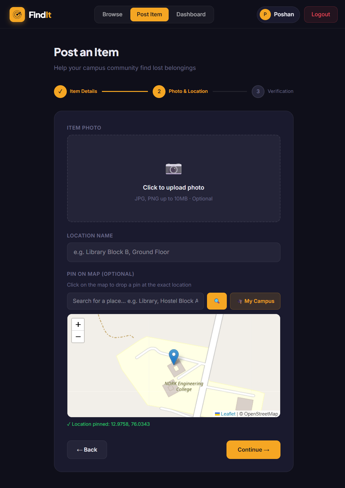
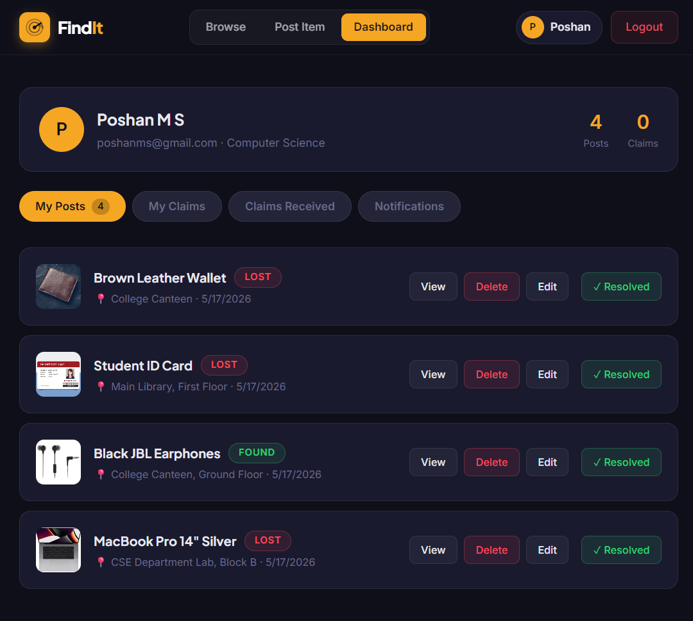
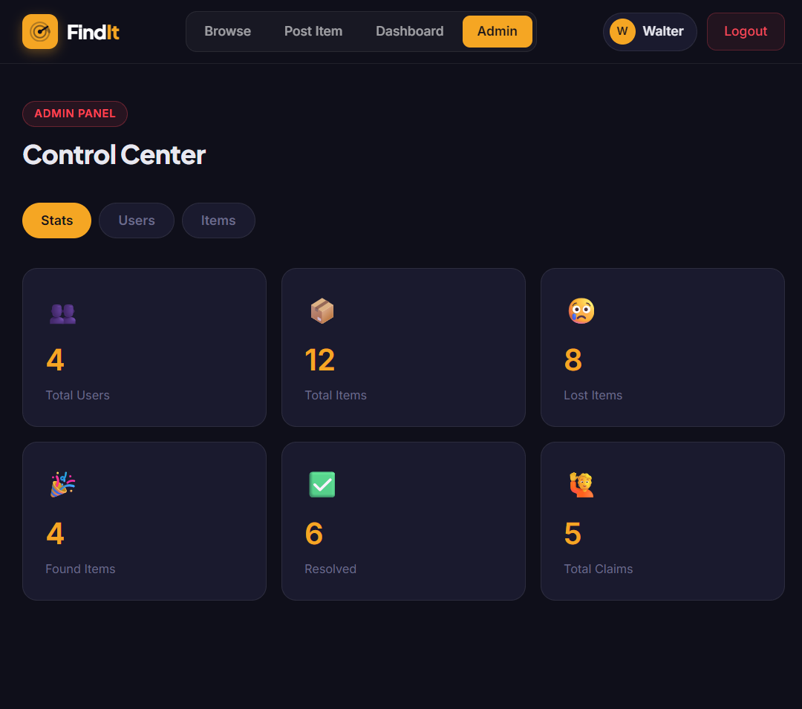

# FindIt — Campus Lost & Found Portal (Frontend)
 

 
[](https://react.dev)
[](https://vitejs.dev)
[](https://www.framer.com/motion)
[](https://socket.io)
[](https://leafletjs.com)
[](https://cloudinary.com)
 
> A professional campus lost & found platform built with React 18 + Vite. Students can report, find, and claim lost items with real-time notifications, image uploads, and an interactive map.
 
---

## 🔗 Live Demo

> **Live Demo:** [https://findit-portal.vercel.app](https://findit-portal.vercel.app)
> **Backend API:** [https://findit-backend-smpr.onrender.com](https://findit-backend-smpr.onrender.com)
> **Backend Repo:** [https://github.com/POSHANMS/lost-found-backend](https://github.com/POSHANMS/lost-found-backend)

---
 
## ✨ Features
 
### Authentication
- [x] Register with name, email, phone, department, password
- [x] Login with JWT access token
- [x] Logout with token cleanup
- [x] Stay logged in on page refresh (token persistence)
- [x] Flash prevention — navbar hides auth buttons while checking auth
- [x] Show/hide password toggle on login and register
- [x] Validation error messages shown clearly (not generic "failed")
- [x] First user to register becomes admin automatically
### Browsing & Search
- [x] Masonry grid layout (not boring uniform grid)
- [x] Real-time search with 500ms debouncing (no button click needed)
- [x] Filter by Lost / Found status
- [x] Filter by category (Electronics, Documents, Accessories, Clothing, Keys, Bags, Other)
- [x] Infinite scroll pagination (IntersectionObserver API)
- [x] Loading skeleton cards while data fetches
- [x] Empty state with illustration and CTA
### Posting Items
- [x] Multi-step form with animated step indicator (3 steps)
- [x] Lost / Found status toggle with color coding
- [x] Category selector with visual pill chips
- [x] Direct Cloudinary image upload from browser (no server middleman)
- [x] Image preview with remove option
- [x] Interactive Leaflet.js map with click-to-pin
- [x] Map place search (OpenStreetMap Nominatim — free geocoding)
- [x] GPS "My Location" button
- [x] "My Campus" quick pin button (preset to college coordinates)
- [x] Location name text input
- [x] Verification question + secret answer (anti-fraud)
- [x] Edit mode — pre-fills form when editing existing item
### Item Detail & Claims
- [x] Full item view with large image
- [x] Image blend mode for clean product photo display
- [x] Map showing exact pin location (read-only)
- [x] Claim button (hidden for item owner, hidden if item resolved)
- [x] Claim modal with verification question displayed
- [x] Flexible answer matching (partial match — "pikachu" matches "pikachu keychain")
- [x] Wrong answer shows error immediately
- [x] Success state after claim submission
- [x] "This is your item" badge for owners
### Dashboard
- [x] User profile card with avatar, name, email, department, stats
- [x] My Posts tab — all items posted by user with image thumbnails
- [x] My Claims tab — claims submitted with status badges
- [x] Claims Received tab — incoming claims on own items
- [x] Approve / Reject claims with one click
- [x] Notifications tab — chronological list
- [x] Mark notifications as read on click
- [x] Unread notification count badge on navbar Dashboard link
- [x] Edit own posts (pre-filled multi-step form)
- [x] Mark items as resolved (removes from Browse)
- [x] Delete own posts with confirmation dialog
### Real-time Notifications
- [x] Socket.io connects automatically after login
- [x] Toast popup appears instantly on screen without page refresh
- [x] Auto-dismisses after 4 seconds
- [x] Manual close button on toast
- [x] Notification badge count updates in real-time
### Admin Panel
- [x] Stats dashboard — total users, items, lost, found, resolved, claims
- [x] Users table — name, email, department, role, ban status
- [x] Ban / Unban users (admin cannot ban themselves)
- [x] Items table — title, category, status, posted by
- [x] Delete any item with immediate cache clear
- [x] Role-based route guard — non-admins redirected
### General
- [x] Protected routes (redirect to login if not authenticated)
- [x] Admin-only route guard (redirect to home if not admin)
- [x] 404 page for unknown routes
- [x] Smooth Framer Motion animations throughout
- [x] Custom favicon (SVG radar pulse icon)
- [x] Custom logo with wordmark
- [x] Google Fonts (Plus Jakarta Sans + Inter)
---
 
## 🛠️ Tech Stack
 
| Category | Technology | Purpose |
|---|---|---|
| Framework | React 18 + Vite 5 | UI library + build tool |
| Styling | CSS Variables + inline styles | Design system theming |
| Animations | Framer Motion 11 | Page + element animations |
| Routing | React Router v6 | Client-side routing |
| HTTP Client | Axios | API requests + interceptors |
| Real-time | Socket.io Client 4 | Live notifications |
| Maps | Leaflet.js + React Leaflet | Interactive maps |
| Map Search | OpenStreetMap Nominatim API | Free place name geocoding |
| Image Upload | Cloudinary (direct browser upload) | Image storage + CDN |
| Auth | JWT stored in localStorage | Session management |
| Fonts | Plus Jakarta Sans + Inter | Premium typography |
 
---
 
## 📁 Project Structure
 
```
lost-found-frontend/
├── public/
│   ├── favicon.svg              # custom FindIt favicon (amber radar icon)
│   └── findit-logo.svg          # full logo with wordmark
├── src/
│   ├── assets/
│   │   └── hero.png             # landing page hero illustration (floating animation)
│   ├── components/
│   │   ├── Navbar.jsx           # sticky navbar, auth state, notification badge, flash fix
│   │   ├── ItemCard.jsx         # reusable item card (used in Browse)
│   │   ├── ItemCardSkeleton.jsx # loading skeleton (pulse animation)
│   │   ├── SearchBar.jsx        # search input component
│   │   └── Map.jsx              # Leaflet map wrapper
│   ├── context/
│   │   └── AuthContext.jsx      # global auth + socket connect + unread count
│   ├── hooks/
│   │   └── useAuth.js           # custom hook — useContext(AuthContext) shortcut
│   ├── pages/
│   │   ├── Landing.jsx          # hero + real stats + how it works + CTA banner
│   │   ├── Login.jsx            # login form with show/hide password
│   │   ├── Register.jsx         # registration with inline validation errors
│   │   ├── Browse.jsx           # masonry grid + debounced search + infinite scroll
│   │   ├── PostItem.jsx         # 3-step form + Cloudinary upload + Leaflet map
│   │   ├── ItemDetail.jsx       # item view + map + claim modal + verification
│   │   ├── Dashboard.jsx        # 4-tab dashboard (posts, claims, received, notifications)
│   │   └── Admin.jsx            # control center (stats, users, items)
│   ├── utils/
│   │   └── api.js               # Axios instance + JWT interceptor + Socket.io export
│   ├── App.jsx                  # routes + toast notifications + 404 + NotFound component
│   ├── main.jsx                 # entry point — wraps app with AuthProvider
│   └── index.css                # CSS variables + global reset + scrollbar + selection
├── .env                         # environment variables (never commit this)
├── index.html                   # Google Fonts links + favicon + page title
├── vite.config.js               # Vite config with React + Tailwind plugins
└── package.json
```
 
---
 
## 🚀 Getting Started
 
### Prerequisites
 
- Node.js 18+
- npm 9+
- Backend running on `http://localhost:5000`
### Installation
 
```bash
# Clone the repository
git clone https://github.com/POSHANMS/lost-found-frontend.git
cd lost-found-frontend
 
# Install dependencies
npm install
```
 
### Environment Variables
 
Create a `.env` file in the root:
 
```env
VITE_API_URL=http://localhost:5000
VITE_CLOUDINARY_CLOUD_NAME=your_cloudinary_cloud_name
VITE_CLOUDINARY_UPLOAD_PRESET=your_upload_preset
```
 
### Run Development Server
 
```bash
npm run dev
```
 
App runs on `http://localhost:5173`
 
### Build for Production
 
```bash
npm run build
```
 
---
 
## 📄 Pages Overview
 
| Page | Route | Auth Required | Description |
|---|---|---|---|
| Landing | `/` | No | Hero, real stats, how it works, CTA |
| Browse | `/browse` | No | All items — masonry, filters, infinite scroll |
| Item Detail | `/item/:id` | No | Single item + map + claim modal |
| Login | `/login` | No | Login with show/hide password |
| Register | `/register` | No | Registration with validation |
| Post Item | `/post` | Yes | Create item or edit (`?edit=<id>`) |
| Dashboard | `/dashboard` | Yes | User activity hub — 4 tabs |
| Admin | `/admin` | Admin only | Platform control center |
| 404 | `/*` | No | Page not found with home button |
 
---
 
## 🔑 Key Implementation Details
 
### Authentication Flow
1. User logs in → backend returns JWT access token
2. Token stored in `localStorage`
3. Axios interceptor adds `Authorization: Bearer <token>` to every request header automatically
4. On page refresh → `AuthContext` `useEffect` calls `/api/auth/me` to restore session
5. While checking auth → navbar renders empty placeholder to prevent Login/Register flash
### Real-time Notifications (Socket.io)
- Socket.io connects immediately after successful login
- User joins personal room: `socket.emit('join', { user_id })`
- Backend emits to `room=user_{id}` on claim submission and claim approval
- `AppContent` listens for `notification` event → creates toast with unique `Date.now()` id
- Toast auto-removes after 4 seconds via `setTimeout`
- Multiple toasts stack correctly with `AnimatePresence`
### Verification System (Anti-fraud)
- Item owner sets a secret question and answer when posting
- Question shown in claim modal — answer field is blank
- Claimant's answer sent to backend as `{ answer, message }`
- Backend uses **partial matching**: `answer in correct_answer OR correct_answer in answer`
- "pikachu" correctly matches "pikachu keychain"
- Wrong answer → 400 error, claim never created, owner never notified
### Image Upload (Direct to Cloudinary)
- User picks image → browser POSTs directly to `api.cloudinary.com/v1_1/{cloud}/image/upload`
- Flask backend never handles the binary file — only receives the URL
- Cloudinary returns `secure_url` and `public_id`
- Frontend stores both in form state
- On submit → `image_url` appended to FormData and sent to Flask
### Debounced Real-time Search
- `searchInput` state drives the input field (updates on every keystroke)
- `search` state drives the actual API call
- `useEffect` on `searchInput` starts a 500ms timer
- If user keeps typing → `clearTimeout` resets the timer
- After 500ms silence → `setSearch(searchInput)` triggers `fetchItems(true)` (reset)
### Infinite Scroll
- `IntersectionObserver` watches a sentinel `<div ref={sentinelRef}>` at bottom
- When sentinel enters viewport AND `hasMore` AND `!loading` → `fetchItems()` called
- New items appended: `setItems(prev => [...prev, ...newItems])`
- `hasMore` set to `false` when `current_page >= pages`
- Shows "You've seen all X items" footer when complete
### Masonry Grid
- CSS `columns: '4 240px'` creates masonry without JavaScript libraries
- `columnGap: '20px'` sets gutters
- `breakInside: 'avoid'` on each card prevents splitting across columns
- Cards with images: 220px height — cards without: 160px
### Multi-step Form with Edit Mode
- `step` state (0/1/2) controls which section is visible
- `AnimatePresence mode="wait"` slides steps in from right, out to left
- `useSearchParams` reads `?edit=<id>` from URL
- If `editId` exists → `useEffect` fetches item and pre-fills all form fields
- Submit sends `PUT /api/items/<id>` for edit, `POST /api/items/` for create
- Verification answer intentionally NOT pre-filled (security: never expose secret)
---
 
## 🎨 Design System
 
### Color Palette
```css
--bg:         #0F0F1A   /* deep space navy */
--surface:    #1A1A2E   /* card backgrounds */
--surface2:   #242438   /* input backgrounds, secondary surfaces */
--accent:     #F5A623   /* warm amber — primary actions */
--accent-dim: rgba(245,166,35,0.15)  /* subtle amber tint */
--lost:       #FF4757   /* urgent red for lost items */
--found:      #2ED573   /* confident green for found items */
--text:       #E8E8F0   /* soft white */
--muted:      #6B6B8A   /* secondary text */
--border:     rgba(255,255,255,0.08) /* subtle glass borders */
--glass:      rgba(255,255,255,0.05) /* glassmorphism backgrounds */
```
 
### Typography
- **Plus Jakarta Sans 800** — all headings (h1–h6)
- **Inter 400/500/600** — body text, labels, buttons
### Design Principles
- Dark mode first (deep navy base, not black)
- Warm amber accent (not generic blue or purple)
- Glassmorphism on navbar (backdrop-filter blur)
- Micro-interactions on every clickable element
- Consistent 8px / 12px / 16px / 24px spacing scale
---
 
## 🌐 Deployment
 
Deployed on **Vercel** (free tier, instant deploys):
 
```bash
npm i -g vercel
vercel --prod
```
 
Set environment variables in Vercel dashboard:
- `VITE_API_URL` → your Render backend URL
- `VITE_CLOUDINARY_CLOUD_NAME`
- `VITE_CLOUDINARY_UPLOAD_PRESET`
---
 
## 📸 Screenshots
 
| Landing Page | Browse Items |
|---|---|
|  |  |
 
| Item Detail | Post Item (Step 2) |
|---|---|
|  |  |
 
| Dashboard | Admin Panel |
|---|---|
|  |  |
 
---
 
## 🧠 What I Learned
 
- Building a production-grade React SPA from scratch with proper architecture
- JWT authentication flow — token storage, interceptors, session restoration
- Real-time communication with Socket.io — rooms, events, auto-connect on login
- Direct browser-to-Cloudinary upload (bypassing the server entirely)
- Leaflet.js with click-to-pin, GPS geolocation, and Nominatim place search
- Framer Motion — page transitions, stagger children, layout animations, AnimatePresence
- Axios interceptors for automatic token injection without repeating code
- React Context API + custom hooks for clean, reusable global state
- Debouncing with setTimeout/clearTimeout for search optimization
- IntersectionObserver API for zero-library infinite scroll
- CSS masonry layout with `columns` property (no JavaScript needed)
- Multi-step form state machine with per-step validation
- Role-based access control with route guards
- Edit mode in forms — detecting URL params and pre-filling state
- Socket.io room-based notifications for targeted real-time events
---
 
## 🔮 Future Improvements
 
- [ ] Forgot password with email reset link
- [ ] Email verification on registration
- [ ] PWA — installable app with push notifications
- [ ] Dark / light mode toggle
- [ ] Item auto-expiry after 30 days with warning email
- [ ] Share item on WhatsApp / social media
- [ ] React Native mobile app
- [ ] Drag and drop image upload
- [ ] Cloudinary AI background removal for product photos
- [ ] Extract ItemCard, SearchBar into proper reusable components
- [ ] Toast notification history panel
- [ ] Map clustering for multiple item pins
- [ ] Advanced filters — date range, radius from a location
- [ ] Student ID verification before posting
- [ ] Pagination page number display (current / total)
- [ ] Item view count analytics
---
 
## 👨‍💻 Author
 
**Poshan M S**
Full Stack Developer
[GitHub](https://github.com/POSHANMS)
 
---
 
## 📝 License
 
MIT License — feel free to use this project for learning purposes.
 